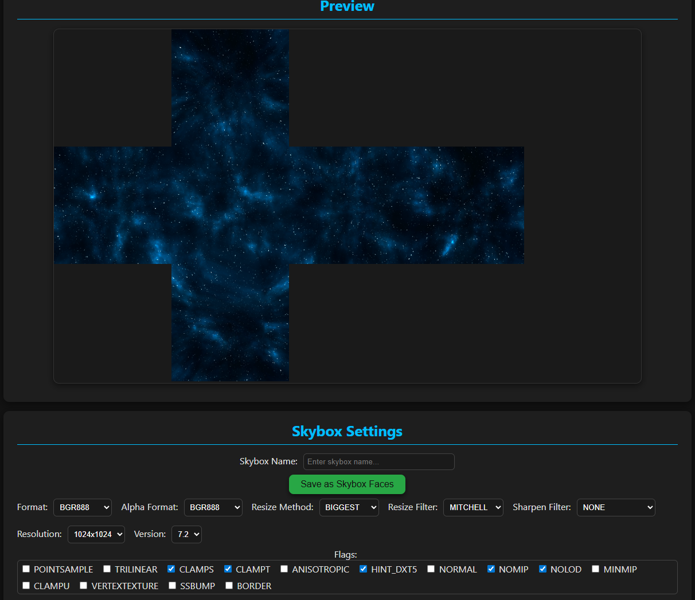
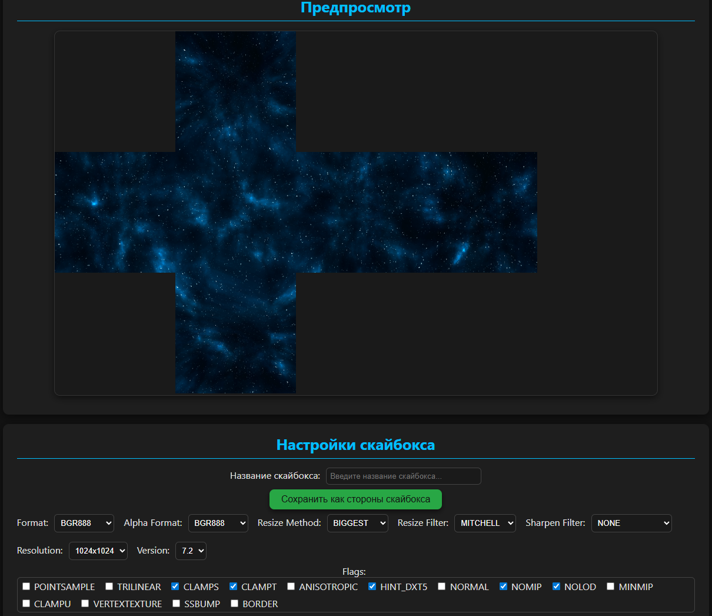

**[RU]** [Перейти к описанию на русском | Jump to RU](https://github.com/null138/se-skybox-generator?tab=readme-ov-file#ru)

# [EN]
***Author***: **Madness (null138)** | [Steam Profile](http://steamcommunity.com/profiles/76561198098349799) | [Discord Server](https://discord.gg/SHW82GMrV4)

# se-skybox-generator
Source Engine: Skybox Generator is a tool designed to automate the creation of skyboxes for Source Engine games. It streamlines the process by converting images into cubemaps, slicing them into the six faces of a cube, and generating the necessary VTF and VMT files.

# Features
- Automatically slices images into six cubemap faces.
- Provides a real-time preview of the complete skybox.
- Saves as .vtf and .vmt files.
- Offers customizable texture settings similar to VTFEdit.

# Usage
- Download the latest release from the [Releases](https://github.com/null138/se-skybox-generator/releases) section.
- Make sure to extract the archive to a folder before running the tool.
- Run the executable.
- Choose the image you want to convert into a skybox.
- The tool will generate the faces. Once finished, a preview will be displayed.
- Adjust texture settings if needed.
- Enter a name for your skybox.
- Click “Save as Skybox Faces” to export the files.
- The .vtf and .vmt files will be saved in the "/output" folder next to the executable.

# Credits
This project includes or is based on the work of the following authors:
- Panorama to Cubemap by [Lucas Crane (jaxry)](https://github.com/jaxry) – licensed under GNU Lesser General Public License v3.0 (LGPL-3.0)
- VTFCmd from VTFLib by Neil "Jed" Jedrzejewski and Ryan "Nemesis" Gregg.

# Notes
**Python turned out to be really slow for image handling (like ~100× slower than JS), so i moved the image generating logic to JavaScript where it runs much faster.**
**That JS part is then bridged into Python for 'VTFCmd'. The interface itself is just done in HTML.**

# 

# [RU]
***Автор***: **Madness (null138)** | [Профиль Steam](http://steamcommunity.com/profiles/76561198098349799) | [Discord сервер](https://discord.gg/SHW82GMrV4)

# se-skybox-generator
Source Engine: Skybox Generator — это инструмент, предназначенный для автоматизации создания скайбоксов для игр на движке Source. Он упрощает процесс, конвертируя панорамные изображения в кубические карты, разделяя их на шесть граней куба и генерируя необходимые файлы VTF и VMT.

# Возможности
- Автоматически делит изображения на шесть граней куба.  
- Предоставляет предварительный просмотр полного скайбокса в реальном времени.  
- Сохраняет файлы в формате .vtf и .vmt.  
- Позволяет настраивать текстуры аналогично VTFEdit.  

# Использование
- Скачайте последнюю версию из раздела [Releases](https://github.com/null138/se-skybox-generator/releases).  
- Обязательно извлеките архив в папку перед запуском инструмента.  
- Запустите исполняемый файл.  
- Выберите изображение, которое хотите конвертировать в скайбокс.  
- Инструмент сгенерирует стороны скайбокса. После завершения появится предварительный просмотр.  
- При необходимости настройте параметры текстуры.  
- Введите имя для скайбокса.  
- Нажмите «Сохранить как стороны скайбокса», чтобы сохранить файлы.  
- Файлы .vtf и .vmt будут сохранены в папке "/output" рядом с исполняемым файлом.  

# Авторы
Проект включает или основан на работе следующих авторов:  
- Panorama to Cubemap от [Lucas Crane (jaxry)](https://github.com/jaxry) – лицензия GNU Lesser General Public License v3.0 (LGPL-3.0)  
- VTFCmd из VTFLib от Neil "Jed" Jedrzejewski и Ryan "Nemesis" Gregg  

# Notes
**Python оказался действительно очень медленным при обработке изображений (примерно в ~100× медленнее, чем JS), поэтому я перенёс логику генерации изображений в JavaScript, где она работает намного быстрее.**
**Эта JS часть затем связана с Python для 'VTFCmd'. Сам интерфейс сделан на HTML.**
